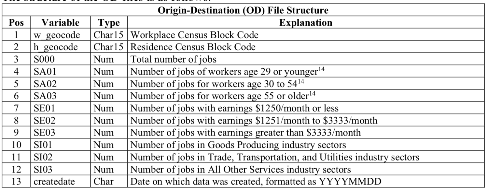
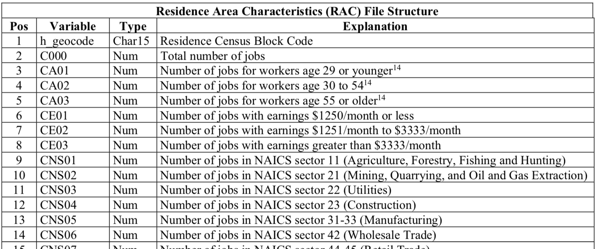
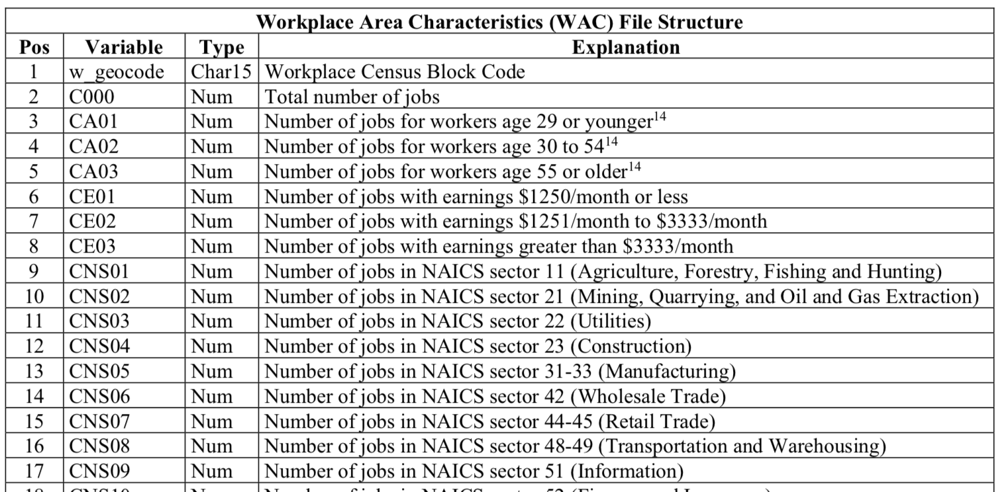
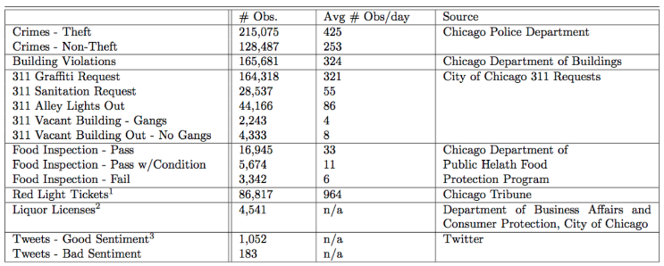
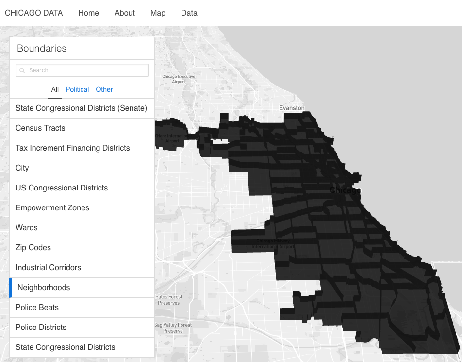
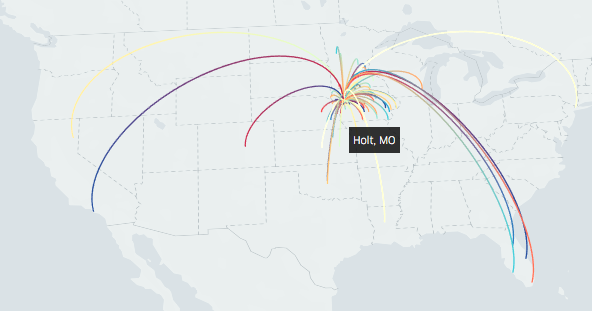

## M.A. Thesis Proposal

### Research Topic
In my paper I want to study how the network structure of Chicago's neighborhoods influence their economic development.  I will rely on theories of influence and power that have been developed and applied to subjects such as social networks, exchange networks, and even web links (PageRank).  Part of my paper will consider if these models of power and influence can be applied in this context.  I plan to test these models against emprical data from the Census Bureau's Longitudinal Employer-Household Dynamics (LEHD) dataset as well as other datasets available at the census block level published by the City of Chicago and other sources.  

Some topics I could cover in my paper include:
- What is the network structure of Chicago's neighborhoods?
- What parts of the city are closely connected and which ones are not?
- How does power/money/etc flow from one part of the city to another?
- How do investments in specific areas of a city spread to other areas?
- Do these network structures have any connection to why some parts of a city grow faster than others, have less crime, etc.?
- What will determine if parts of a city are connected?

### Literature Review
### Theories
#### The Distribution of Power in Exchange Networks: Theory and Experimental Results.
This paper presents an analysis of the strcutural determinants of power in exchange networks though both experimental and simulation studies.  They show that power does not equal centrality in exchange networks which contradicts much social network research that assumes centrality is equivalent to power.
- Cook, Karen S., et al. “The Distribution of Power in Exchange Networks: Theory and Experimental Results.” American Journal of Sociology, vol. 89, no. 2, 1983, pp. 275–305. JSTOR, JSTOR, www.jstor.org/stable/2779142.

#### Power and Centrality: A Family of Measures
This paper looks at how, in bargaining situations, it is advantageous to be connected to those who have few options because power comes from being connected to those who are powerless.  Being connected to powerful others who have many potential trading partners reduces one's bargaining power.  The author's develop a model for centrality to this end.
- Bonacich, Phillip. "Power and Centrality: A Family of Measures."" American Journal of Sociology, vol. 92, no. 5, 1987, pp. 1170–1182. JSTOR, JSTOR, www.jstor.org/stable/2780000.

#### On the Geographical Interpretation of Eigenvalues.
This paper outlines a few examples of how one can peroform matrix algebra on matricies produced by geographic relationships.  For example, it looks out the outline of a road network in Uganda in 1921 and produces a matrix of well-contected towns.  It shows how vectors representing well-connected towns will not only lie in the middle of a large number of dimensions but will tend to lie close to the principal axis of the matrix.  Looking at a road network in Syria Other while towns that are moderately well coneteced will not lie in the middle of so many dimensions as the well-connected towns and will form small culsters on their own.  These may lie close to oehter eigenvectors which aregeographic matricies
- Gould, P. R. “On the Geographical Interpretation of Eigenvalues.” Transactions of the Institute of British Geographers, no. 42, 1967, pp. 53–86. JSTOR, JSTOR, www.jstor.org/stable/621372.

#### Linking Economic Complexity, Institutions, and Income Inequality
This paper shows that an economic complexity index captures information about an economy’s level of development that is relevant to the ways an economy generates and distributes its income. It suggests that a country’s productive structure may limit its range of income inequality.  Do neighborhood networks capture information about a neighborhoods development?
- Dominik Hartman et al. "Linking Economic Complexity, Institutions, and Income Inequality" (2015), https://atlas.media.mit.edu/static/pdf/LinkingEconomicComplexityInstitutionsAndIncomeInequality.pdf

Others
- Phillip D. Straffin, "Linear Algebra in Geography: Eigenvectors of Networks," Mathematics Magazine, Vol. 53, No. 5 (Nov., 1980), pp. 269-276.
- Hal Caswell, Matrix Popoulation Models, Sinauer, 1989.
- http://matrixapps.blogspot.com/2010/07/gould-index-matrix-application-to.html

### Papers Using LEHD Dataset
#### Analyzing temporal changes in land-use–transportation relationships: A LEHD-based approach
This paper looks at commuting-land-use relationship to study how jobs and housing impacts broader transportation patterns, particularly commuting outcomes. It estimates several commuting and jobs–housing metrics from the LEHD dataset and looks at how the 2007 recession affected travel and commuting patterns.
- Andrew Owen, David M. Levinson Modeling the commute mode share of transit using continuous accessibility to jobs Transportation Research Part A: Policy and Practice, Volume 74, 2015, pp. 110-122, http://www.sciencedirect.com/science/article/pii/S0143622812000975 

#### Multivariate spatio-temporal models for high-dimensional areal data with application to Longitudinal Employer-Household Dynamics
This paper explains how to analyze spatio-temporal data in an extremely high dimensional setting.  Motivated by the LEHD dataset they introduce a multivariate spatio-temporal mixed effects model (MSTM), which can be used to efficiently model high-dimensional multivariate spatio-temporal areal data sets.
- Bradley, Jonathan R.; Holan, Scott H.; Wikle, Christopher K. Multivariate spatio-temporal models for high-dimensional areal data with application to Longitudinal Employer-Household Dynamics. Ann. Appl. Stat. 9 (2015), no. 4, 1761--1791. doi:10.1214/15-AOAS862. https://projecteuclid.org/euclid.aoas/1453993093

### Other Interesting Papers Papers On Topic
- http://www.nature.com/news/physicists-make-weather-forecasts-for-economies-1.16963
- https://www.nature.com/articles/srep00723 A New Metrics for Countries' Fitness and Products' Complexity
- https://arxiv.org/pdf/1601.05012.pdf A Simple Measure of Economic Complexity
- https://en.wikipedia.org/wiki/Economic_Complexity_Index
- https://www.ucl.ac.uk/bartlett/casa/research/current-projects/urban-dynamics-lab

### Timeline
- December - Jan 14th: Literature Review, Data Collection/Organization
	- Draft of literature review section (~8 pages)
	- Draft of data collection section (~4 pages)
- Model Building and Data Analysis: Jan 14th - Feb 14th
- Writing: Feb 14th - March 14th
	- Model Explination/Analysis (~15 pages)
	- Abstract/Intro/Conclusion (~5 pages)
- April 1st, 2018: First Draft Due
- May 1st, 2018: Final Draft Due

### Datasets
I plan on publishing all the scripts I used to download/transform/store data onto GitHub.

#### Longitudinal Employer-Household Dynamics
This is dataset is generated by the US Census bureau and provides detailed Employee-Employer relationships at the block level.  The census bureau creates this dataset by using data that states supply on quarterly worker wage and employment records (QCEW) and merging it with their Master Address File and Business Registrar File. The dataset has been produced quarterly from 2005 to 2014.  A summary of each table is provided below.  http://www.nber.org/chapters/c0485.pdf

##### Origin-Destination 

##### Workplace Area Characteristics

##### Residential Level Characteristics

#### Open Street Map Transportation Routes.  
OSM is a collaborative project to create a free editable map of the world.  The OSM project began in 2004 and aggregates user generated and government map related data. In my analysis, I plan to use road and transportation related data such as bus and subway routes to build a map of how different blocks relate to each other.  One drawback of the data source is that you can’t see how data has changed over time (ie if a road was added or a bus route was added).
Data acquisition phase: I have downloaded the data and made a few maps (using the OSMNX package from )

#### City of Chicago Open Data Portal and Plenario
The City of Chicago publically releases many datasets.  Data I have from my previous work is below

In addition, I have recently added the following datasets which provide more business data:

##### Building Permits (2006-present)
Permits issued by the Department of Buildings in the City of Chicago from 2006 to the present.
https://data.cityofchicago.org/Buildings/Building-Permits/ydr8-5enu

##### Small Business Improvement Funds (2001 – 2012)
Funds used to help owners of commercial and industrial properties within specific TIF districts to repair or remodel their facilities for their own business or on behalf of tenants.
https://data.cityofchicago.org/Community-Economic-Development/Small-Business-Improvement-Fund-SBIF-Grant-Agreeme/jp7n-tgmf

Data acquisition phase: I have all the data being downloaded into database daily.  Time spans on each dataset vary slightly

### Data Visualization
As part of the project I will build some interactive visualizations published on the web.  For example I would like to display the networks of census blocks in the US and how they are connected via the LEHD Dataset.  An example of similar visualization I would like to create is below.  

Some tech I will use include:
- http://uber.github.io/deck.gl/#/
- https://uber.github.io/react-map-gl/
- https://www.mapbox.com/

